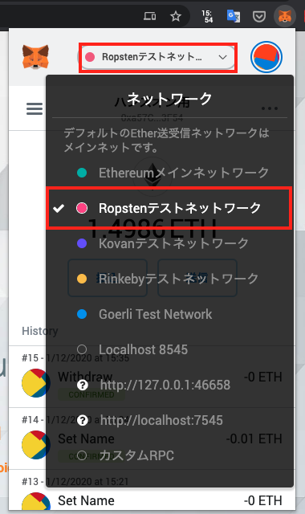
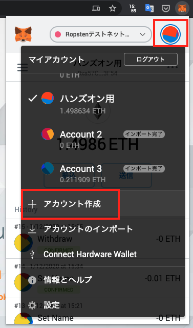
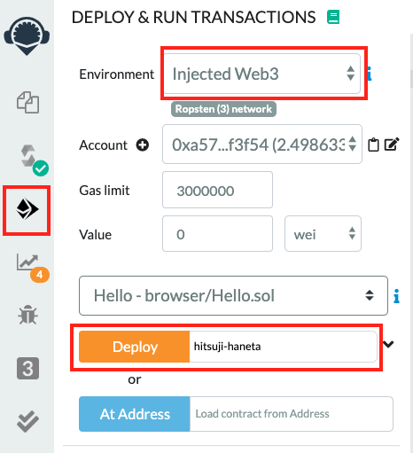
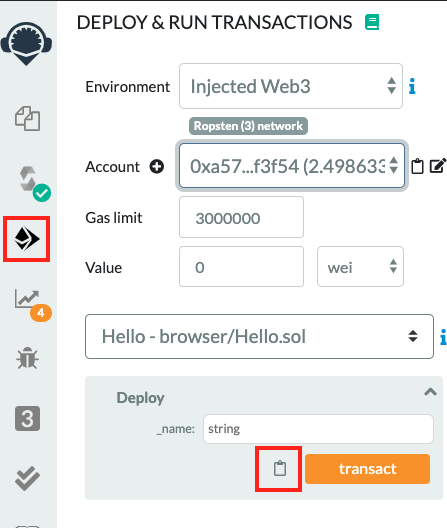
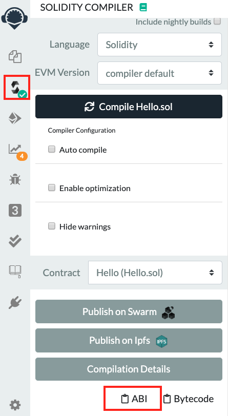
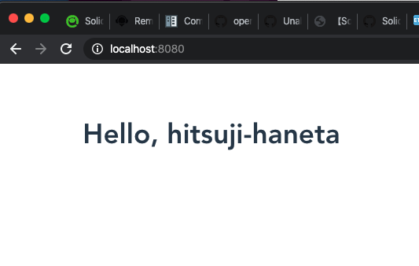
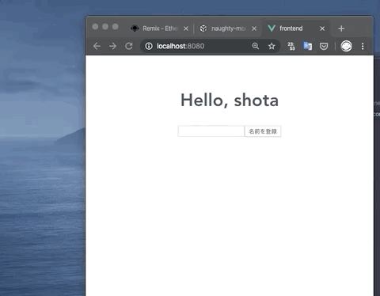

# ブロックチェーンハンズオン仙台

## 事前準備
1. Metamaskプラグインを導入します。  
  https://metamask.io/
2. テストネット（Ropsten）を選択します。  
  
3. アカウントを作成します。  
  
4. ETH(通貨)を取得します。  
「振込」→「Etherを取得する」→「request 1 ether from faucet」

## コントラクトの作成
1. Ethereum用クラウドIDE「Remix」を開きます。  
  https://remix.ethereum.org
2. コントラクト`Hello.sol`を作成します。  
```
pragma solidity ^0.5.0;

contract Hello {
  address payable internal owner;
  string name;
  uint public balance;

  constructor (string memory _name) public {
    name = _name;
    owner = msg.sender;
  }

  function setName(string memory _name) public payable {
    require(msg.value == 0.01 ether, "料金は0.01ETHです。");
    balance += msg.value;
    name = _name;
  }

  function greet() public view returns (string memory) {
    return string(abi.encodePacked(bytes("Hello, "), bytes(name)));
  }

  function withdraw() public {
    require(msg.sender == owner, "オーナー以外は引き出しできません。");
    uint amount = balance;
    balance = 0;
    owner.transfer(amount);
  }
}
```
3. 作成したコントラクトをコンパイルします。  
  サイドバーから「Solidity compiler」のマークを選択し、「Conpile Hello.sol」を押下してください。  
  

4. コントラクトをテストネットにデプロイします。  
  サイドバーから「Deploy & run transactions」のマークを選択。  
  → Environmentで「Injected Web3」を選択。（Metamaskで選択中のネットが使用されます）  
  → コンストラクタの入力となる文字列を入れて、「Deploy」を押下してください。  
  

## フロントエンドの作成
### vueプロジェクトの作成
1. 任意のディレクトリでvue.jsのプロジェクトを作成します。  
```
$ npx @vue/cli create frontend
```
→ 設定はdefaultでOKですが、eslintに慣れてない人はマニュアルセレクトで外したほうがいいかも。  
→ default（eslintあり）にした人は、`frontend/package.json`に以下を追加してください。  
```frontend/package.json
  "eslintConfig": {
    ...
    "rules": {
+     "no-console": 0
    },
    ...
  },
```

2. まずは試しに起動してみましょう。  
```
$ cd frontend
$ npm run serve
```
→ https://localhost/8080 で確認できたらOK。  

### メッセージの取得
1. コントラクト使用モジュールを作成します。  
→ `frontend/src/lib/contract.js`として以下を作成してください。
```frontend/src/lib/contract.js
import Web3 from 'web3';

let web3;
if (typeof window.web3 !== 'undefined') {
  web3 = new Web3(window.web3.currentProvider);
} else {
  alert('MetaMaskをインストールして下さい');
}

const address = '<Remixからコピペ①>';
const abi = <Remixからコピペ②>;
export const contract = new web3.eth.Contract(abi, address);
```
`address`と`abi`はRemixから取得します。  
- address  
  
- abi  
  

2. 作成したモジュールを使用してコントラクトからHello.greetメソッドを呼び出します。  
→ `frontend/src/App.vue`を以下のように書き換えてください。  
```frontend/src/App.vue
<template>
  <div id="app">
    <h1>{{message}}</h1>
  </div>
</template>

<script>
import { contract } from "./lib/contract";

export default {
  name: "app",
  data() {
    return {
      message: ""
    };
  },
  mounted: async function() {
    this.greet();
  },
  methods: {
    greet: async function() {
      this.message = await contract.methods.greet().call();
    }
  }
};
</script>

// <style>以下はそのままでいいです。
```

3. 起動してこんな感じになったら成功！  
  

## メッセージの変更
1. Metamaskからアカウントを取得するメソッドを作ります。  
→ `frontend/src/lib/contract.js`に以下を追加してください。  
```frontend/src/lib/contract.js
  export const contract = new web3.eth.Contract(abi, address);

+ export const getAccount = async () => {
+   const accounts = await web3.eth.getAccounts();
+   if (accounts.length === 0 || !accounts[0]) {
+     throw new Error('Ethereumアカウントが空です。');
+   }
+   return accounts[0];
+ };

+ export const CHARGE = Web3.utils.toWei('0.01', 'ether');
```

2. 名前入力用のフォームを作ります。  
→ `frontend/src/App.vue`に以下を追加してください。  
```frontend/src/App.vue
...
      <h1>{{message}}</h1>
+     <p>{{name}}</p>
+     <input type="text" v-on:input="changeName" />
+     <button v-on:click="setName">名前を登録</button>
+     <p>{{status}}</p>
    </div>

...

    data() {
      return {
+       name: "",
+       status: "",
        message: ""
      };
    },
    mounted: async function() {
      this.greet();
    },
    methods: {
+     setName: async function() {
+       console.log(this.name);
+     },
+     changeName: function(event) {
+       this.name = event.target.value;
+     },
      greet: async function() {
        this.message = await contract.methods.greet().call();
      }
```
→ 名前が入力できるようになったらOK！  

3. 名前変更のコントラクトを実行  
→ `frontend/src/App.vue`を以下のように変更してください。  
```
...

<script>
- import { contract } from "./lib/contract";
+ import { contract, getAccount, CHARGE } from "./lib/contract";

...

      mounted: async function() {
        this.greet();
+       this.status = "名前を変更中…";
+       const from = await getAccount();
+       contract.methods
+         .setName(this.name)
+         .send({ from, value: CHARGE })
+         .on("receipt", receipt => {
+           console.log(receipt);
+           this.status = "成功しました！😆";
+           this.greet();
+         })
+         .on("error", error => {
+           console.log(error);
+           this.status = "失敗しました😢";
+         });
      },
```

4. こんな感じで動いたら成功！  
  

## チャレンジ課題
フロントエンドに引き落とし用のボタンを作り、お金を引き落とせるようにしてみましょう！  
ヒント：Hello.withdraw()を使用します。